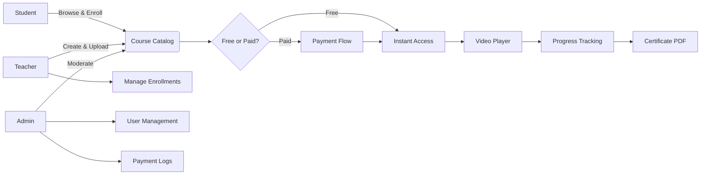
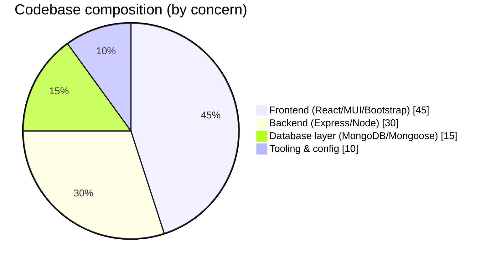
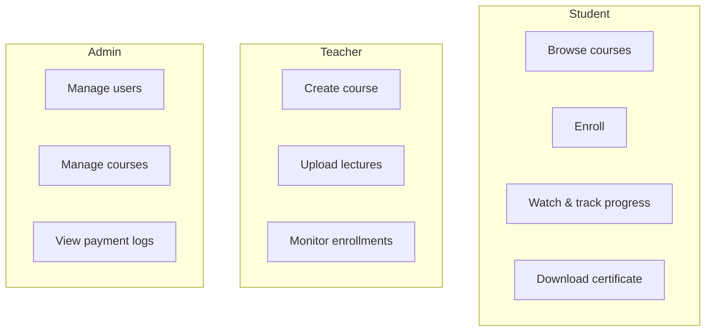

<div align="center">

<br/>

```
 _                                _   _       _     
| |                              | | | |     | |    
| |      ___  __ _ _ __ _ __     | |_| |_   _| |__  
| |     / _ \/ _` | '__| '_ \    |  _  | | | | '_ \ 
| |____|  __/ (_| | |  | | | |   | | | | |_| | |_) |
\_____/ \___|\__,_|_|  |_| |_|   \_| |_/\__,_|_.__/ 
                                                    
```

### A full-stack e-learning platform for video-based courses

<br/>

[](https://www.mongodb.com)
[](https://expressjs.com)
[](https://react.dev)
[](https://vitejs.dev)
[](LICENSE)
[](#-deployment)

<br/>

> LearnHub connects students and educators through video courses, enrollment, and progress tracking, built on the MERN stack.
>
> 🚧 Runs locally for now. Hosting decision is still open, see [Deployment](#-deployment).

<br/>

[Features](#-key-features) · [Tech Stack](#-tech-stack) · [Getting Started](#-getting-started) · [Demo Accounts](#-demo-accounts) · [Architecture](#-project-structure) · [Deployment](#-deployment)

---

</div>

## 🤝 Contributors

Thanks to everyone who has contributed to **LearnHub** 🎉

<br/>

<div align="center">

<table>
  <tbody>
    <tr>
      <!-- Repeat this <td> block for each contributor -->
      <td align="center" valign="top" width="14.28%">
        <a href="https://github.com/udaycodespace">
          
          <br/><sub><b>udaycodespace</b></sub>
        </a>
        <br/>💻 🐛 ⚡ 🎨 📖
      </td>
      <!-- /repeat -->
    </tr>
  </tbody>
</table>

</div>

<br/>

> 💻 Code &nbsp;·&nbsp; 🐛 Bug fix &nbsp;·&nbsp; 🧪 Tests &nbsp;·&nbsp; 🔒 Security &nbsp;·&nbsp; ⚡ Performance &nbsp;·&nbsp; 🎨 Design &nbsp;·&nbsp; 📖 Docs &nbsp;·&nbsp; 🚇 Infrastructure &nbsp;·&nbsp; ♿ Accessibility &nbsp;·&nbsp; 👀 Review

---

<br/>

## 🌟 Overview

LearnHub is a course platform where teachers upload video lectures and students work through them at their own pace. Students enroll, watch content, mark sections complete, and download a certificate once they finish a course. Teachers get their own dashboard to publish courses and check who's enrolled. Admins can see everything on the platform: users, courses, and payment activity.

<br/>

## 🧭 How it fits together



<br/>

## 🛠 Tech Stack

<div align="center">

### Backend

| | Technology | Purpose |
|---|---|---|
|  | **Express.js** | Routes, middleware, and controllers |
|  | **MongoDB** | Stores users, courses, payments, and activity logs |
|  | **Node.js** | Runs the server |

### Frontend

| | Technology | Purpose |
|---|---|---|
|  | **React** | Component-based UI |
|  | **Material UI** | Tables, dashboard buttons, icons |
|  | **Bootstrap** | Grid layouts, forms, modals |

### Tooling & DevX

| | Technology | Purpose |
|---|---|---|
|  | **Vite** | Dev server and build tool |
|  | **Axios** | HTTP requests to the backend |

</div>

<br/>

### Stack breakdown



<br/>

## ✨ Key Features

<table>
<tr>
<td width="33%" valign="top">

### 👨‍🎓 Student
- Browse and search courses by title or category
- Enroll instantly in free courses, or pay for premium ones
- Stream lectures with the built-in video player
- Mark sections complete and download a certificate

</td>
<td width="33%" valign="top">

### 👩‍🏫 Teacher
- Create courses with title, category, description, and price
- Upload lecture videos as `.mp4` files
- Track enrollment numbers for your own courses
- Delete courses you created

</td>
<td width="33%" valign="top">

### 🛡️ Admin
- View and manage every registered account
- Remove any course from the platform
- Review activity logs and enrollment data
- Track payment transactions platform-wide

</td>
</tr>
</table>

<br/>

## 👥 Who does what



<br/>

## 📁 Project Structure

```
learnhub/
│
├── backend/                    # Express API and database models
│   ├── src/
│   │   ├── controllers/
│   │   ├── models/             # Mongoose schemas
│   │   ├── routes/             # Express routes
│   │   ├── middleware/         # Auth verification
│   │   └── config/             # DB connection setup
│   ├── .env
│   └── package.json
│
└── frontend/                   # React SPA powered by Vite
    ├── src/
    │   ├── pages/               # Route-level pages
    │   ├── hooks/                # Custom React hooks
    │   └── components/           # Grouped by Admin/User/Common
    └── package.json
```

<br/>

## 🚀 Getting Started

There's no live demo yet, so you'll need to run this locally.

### Prerequisites

-  **Node.js 18+**
-  **MongoDB**

---

### 1. Clone & install

```bash
git clone https://github.com/udaycodespace/learnhub.git
cd learnhub

cd backend && npm install
cd ../frontend && npm install
```

### 2. Configure environment

Copy the example environment file to `.env` and fill in your own values:

```bash
cp backend/.env.example backend/.env
```


### 3. Run it

```bash
# Terminal A — Backend
cd backend
npm start
# → http://localhost:5000
```

```bash
# Terminal B — Frontend
cd frontend
npm run dev
# → http://localhost:5173
```

### 4. Seed demo data *(optional)*

There's no seeder script in this project yet. If you add one, document it here.

<br/>

## 🔑 Demo Accounts

| Role | Email | Password |
|------|-------|----------|
| Student | `TODO: confirm` | `TODO: confirm` |
| Teacher | `TODO: confirm` | `TODO: confirm` |
| Admin | `admin` | `admin123` |

<br/>

## 🪝 Custom Hooks

None yet. If you build one, add it here with a short usage example:

```ts
// const { hookExports } = useCustomHook();
```

<br/>

## 📜 Scripts

### Backend (`backend/`)

| Command | Description |
|---------|-------------|
| `npm start` | Starts the backend with nodemon |

### Frontend (`frontend/`)

| Command | Description |
|---------|-------------|
| `npm run dev` | Starts the Vite dev server |
| `npm run build` | Builds the production bundle |
| `npm run preview` | Previews the production build locally |

<br/>

## 🌐 Deployment

Not deployed yet, and that's on purpose for now. I'd rather see how the project grows and what contributors actually need before locking in a hosting setup.

If you have thoughts on where this should live (Vercel, Render, Railway, self-hosted, or something else), open a discussion or an issue. That'll shape the decision more than me guessing upfront.

Want to help set up CI/CD once a direction is picked? Check [CONTRIBUTING.md](CONTRIBUTING.md).

<br/>

## 📄 License

Distributed under the **ISC License**. See [`LICENSE`](LICENSE) for details.

---

<div align="center">

<br/>

**Built as a full-stack e-learning project**

*If this was useful, a ⭐ helps other people find it*

<br/>

[](https://skillicons.dev)

</div>