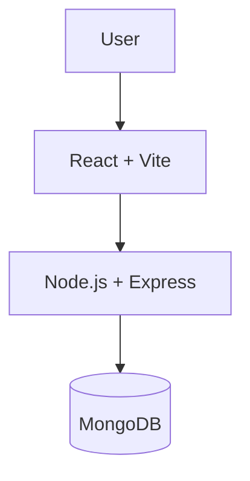
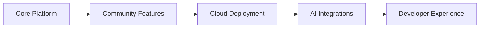

<h1 align="center">LearnHub</h1>

<p align="center">
An open-source learning platform built with the MERN stack.
</p>

<p align="center">


</p>

---

## Overview

LearnHub is an open-source learning platform focused on building a modern and scalable learning experience. The project serves as a collaborative platform where developers can contribute across frontend, backend, cloud infrastructure, documentation, testing, and DevOps while exploring real-world software development practices.

---

## System Architecture



---

## Technology Stack

| Layer | Technologies |
|--------|--------------|
| Frontend | React, Vite |
| Backend | Node.js, Express.js |
| Database | MongoDB |
| Authentication | JWT |
| APIs | REST |
| DevOps | GitHub Actions, Docker |
| Cloud | Azure, AWS, Vercel |

---

## Repository Structure

```text
learnhub/
│
├── backend/
├── frontend/
├── README.md
└── LICENSE
```

---

## Development Roadmap



---

## Contribution Areas

| Domain | Description |
|--------|-------------|
| Frontend | User interface and user experience |
| Backend | APIs and business logic |
| Database | Data modeling and optimization |
| DevOps | CI/CD, Docker, Cloud |
| Testing | Unit and integration testing |
| Documentation | Guides and project documentation |

---

## Contributing

LearnHub is built as a community-driven project. Contributions, feature proposals, bug reports, and documentation improvements are always welcome.

---

## License

Licensed under the MIT License.